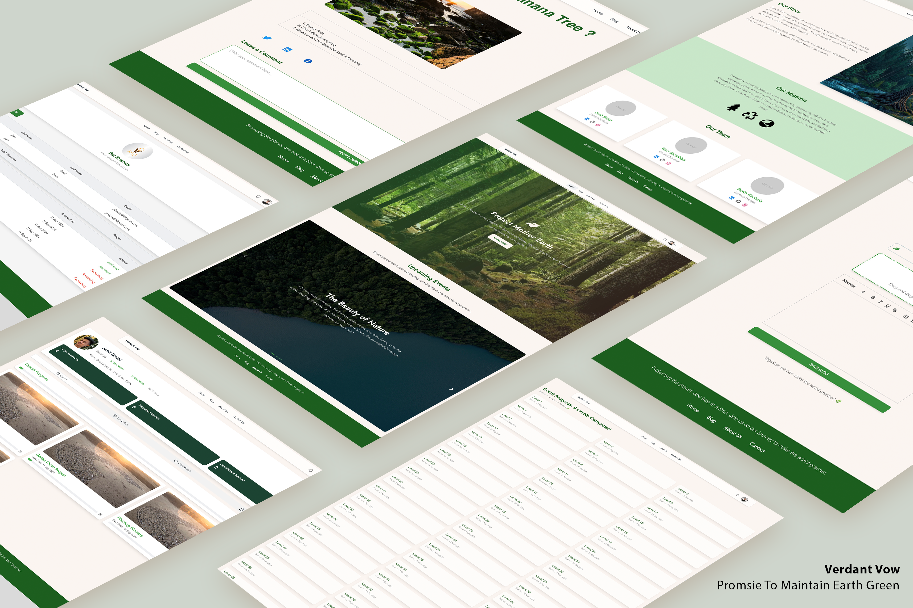
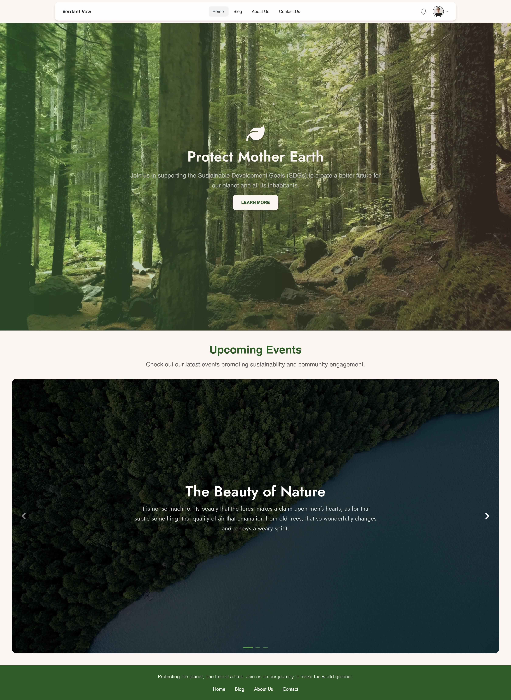
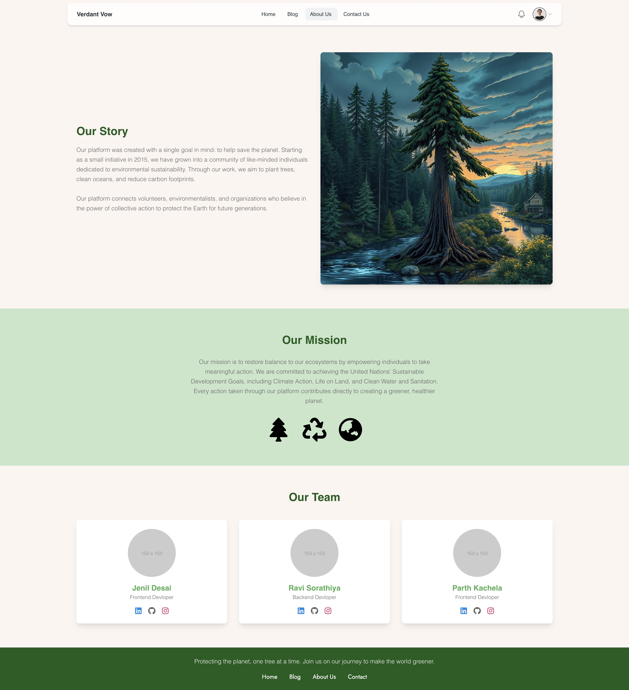
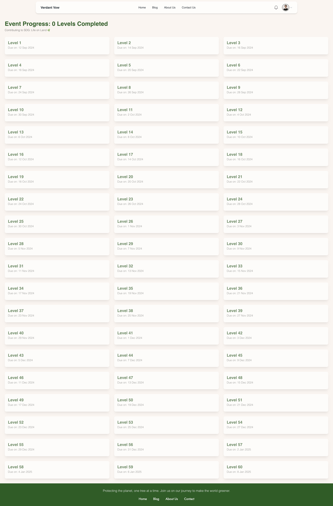
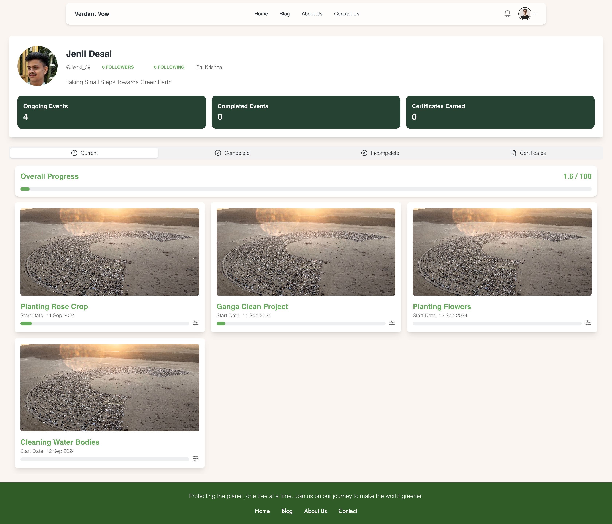
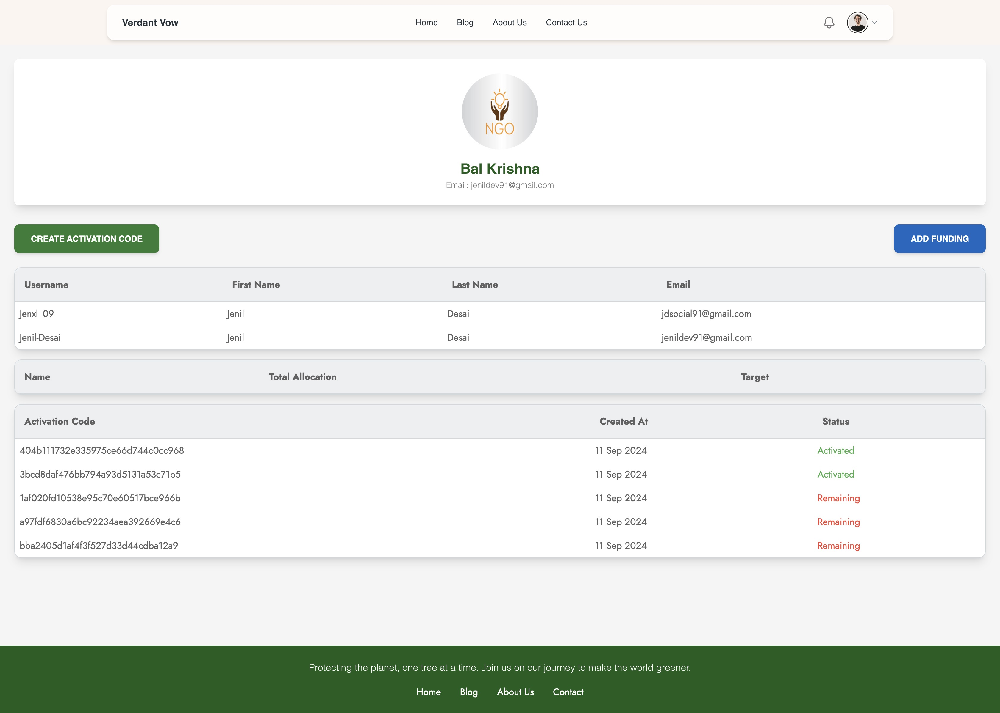
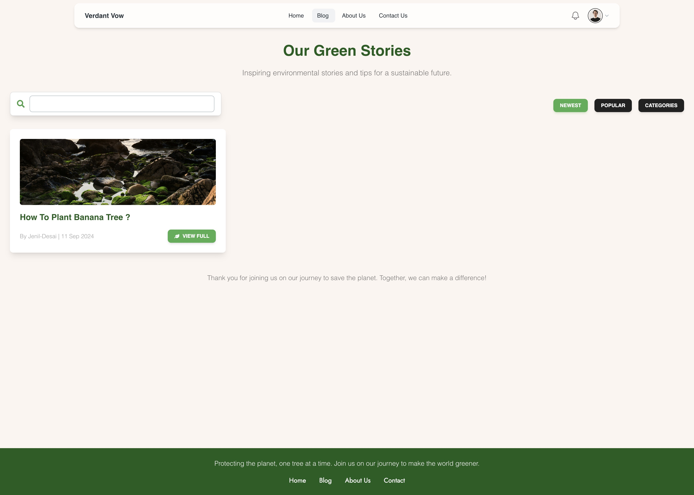
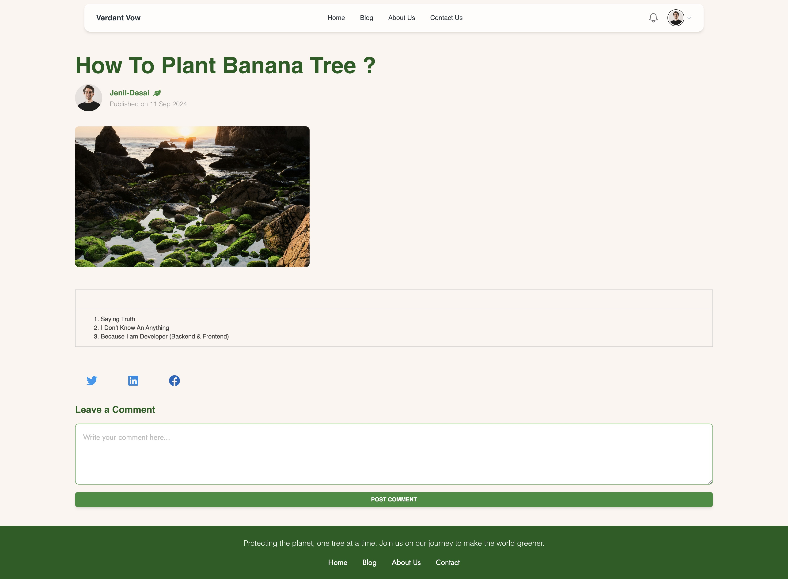

# 🌐 Verdant Vow

Welcome to **Verdant Vow**! This platform was developed as part of Hackathon 2024 to promote sustainability through tree care initiatives. The project aligns with the Sustainable Development Goals (SDGs), focusing on climate action and life on land. Users can create events, track their progress, and receive certificates, while organizations manage participants and funds.

---

## 📑 Table of Contents

1. [Overview](#-overview)
2. [Technologies](#-technologies)
3. [Packages & Libraries Used](#-packages--libraries-used)
4. [Getting Started](#-getting-started)
5. [Setup](#-setup)
6. [Features](#-features)
7. [Demo & Screenshots](#-demo--screenshots)
8. [Acknowledgments](#-acknowledgments)
9. [License](#-license)

---

## 🌟 Overview

**Description**: Verdant Vow is a platform developed as part of Hackathon 2024, focusing on promoting sustainability through tree care initiatives. It aligns with the Sustainable Development Goals (SDGs), particularly emphasizing climate action and life on land. Users can create events, track their progress, and receive certificates, while organizations manage participants and funds.

---

## 💻 Technologies

Below is a breakdown of the core technologies used in this project.

| 🌐 Web       | Backend     | Database         |
| ------------ | ----------- | ---------------- |
| **React.js** | **Node.js** | **Postgres SQL** |

---

## 📦 Packages / Libraries Used

This project uses the following essential libraries and packages:

| Package / Library           | Purpose                              |
| --------------------------- | ------------------------------------ |
| `Express.js`                | Backend framework                    |
| `Prisma ORM`                | Database ORM                         |
| `JWT`                       | Authentication and authorization     |
| `Joi`                       | Input validation                     |
| `Node Cron`                 | Scheduled tasks                      |
| `Nodemailer`                | Email management                     |
| `Cloudinary`                | Media storage                        |
| `bcrypt`                    | Password hashing                     |
| `body-parser`               | Middleware for parsing HTTP requests |
| `cors`                      | Cross-origin resource sharing        |
| `dayjs`                     | Date handling                        |
| `multer`                    | File uploads                         |
| `multer-storage-cloudinary` | Cloudinary file storage integration  |
| `uuid`                      | Unique identifiers                   |
| `tailwind css`              | Styling framework                    |
| `Material Tailwind css`     | UI components                        |
| `react-router-dom`          | Frontend routing                     |
| `heroicons`                 | Icon library                         |
| `font awesome`              | Icon library                         |
| `recoil`                    | State management                     |
| `react-quill`               | Rich text editor                     |
| `moment`                    | Date handling                        |
| `axios`                     | API requests                         |

---

## 🚀 Getting Started

Follow these steps to set up the project in your local environment:

1. Clone the repository:
   ```bash
   git clone https://github.com/Jenil-Desai/verdant-vow.git
   ```
2. Install dependencies:
   ```bash
   cd server
   npm install
   cd ../frontend
   npm install
   ```
3. Configure Enviroment Variables by creating `.env` in both server and frontend folder and add :

   ```env
   DATABASE_URL=your_postgresql_database_url
   EMAIL=your_email
   EMAIL_PASSWORD=your_email_password
   JWT_SECRET=your_jwt_secret
   CLOUD_NAME=your_cloudinary_cloud_name
   CLOUD_API_KEY=your_cloudinary_api_key
   CLOUD_API_SECRET=your_cloudinary_api_secret
   ```

   ```env
   VITE_REACT_BASE_URL="http://localhost:3000/api/v1"
   ```

---

## ⚙️ Setup

1. Start the project server:
   ```bash
   cd server
   npm run dev
   ```
2. Start the project frontend:
   ```bash
   cd frontend
   npm run dev
   ```
3. Access the application at `localhost:5173` and explore the website.

---

## 🎯 Features

Explore the unique features available in this application:

### 🙋🏻‍♂️ User Features:

1. **Create Events**: Define event duration and frequency, and upload progress through levels with images and descriptions.
2. **Receive Certificates**: Earn certificates from renowned NGOs after completing events.

### 🏢 Organization Features:

1. **Generate Activation Codes**: For users to join the platform and events.
2. **Manage Events and Users**: Track user participation and manage funds provided by the government.
3. **Manage Funds**: Organizations can maintain government-provided funds for event management.

### 🔑 Key Features:

1. **User Events**: Create events with a name, number of days, and frequency. Track levels and upload posts.
2. **Organization Accounts**: Manage users, generate activation codes, and maintain funds.
3. **Certificates**: Recognize successful event completion with certificates.

### 🌏 SDG Alignment:

1. **Goal 13: Climate Action** – Fighting climate change through tree care.
2. **Goal 15: Life on Land** – Promoting biodiversity and reforestation.

### 🏆 Hackathon 2024:

1. Developed for Hackathon 2024, focusing on leveraging technology to support environmental conservation and the Sustainable Development Goals (SDGs).

### 🍃 Environmental Theme:

1. Nature-inspired color palette, green accents, and responsive layouts to promote sustainability.

---

## 🔗 Demo & Screenshots

| Mock Up                             | Home Page                                | About Us Page                            | Levels Page                              |
| ----------------------------------- | ---------------------------------------- | ---------------------------------------- | ---------------------------------------- |
|  |  |  |  |

| User Profile                                   | Org. Profile                                           | Blog List Page                                | Blog Page                            |
| ---------------------------------------------- | ------------------------------------------------------ | --------------------------------------------- | ------------------------------------ |
|  |  |  |  |

---

## 🙏 Acknowledgments

We’d like to thank the following resources:

- **[Material Tailwind Docs](https://material-tailwind.com/docs)** - UI components and styling.
- **[Cloudinary](https://cloudinary.com/)** - Media storage and management.
- **[Apna College Delta 3.0 Course](https://apnacollege.in/)** - Course resource.
- **[Harkirat 100xDevs Course](https://100xdevs.com/)** - Backend development.

---

## 📜 License

This project is licensed under the [MIT License](LICENSE). See the [LICENSE](LICENSE) file for details.

---

### Enjoy exploring and contributing to Verdant Vow!
